# Building a Database Engine in Go — Architectural Design

## Full Layer Stack

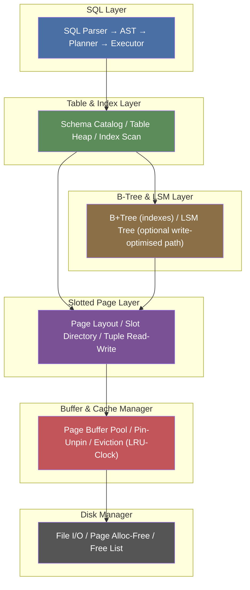

> **Key rule:** every layer only talks to the layer directly below it. The SQL layer never touches disk. The Disk Manager knows nothing about tuples.

---

## 1 — Disk Manager

The foundation. It owns the physical database file and thinks purely in fixed-size **pages** (4 KB is a good default). Nothing above this layer ever calls `os.Read` or `os.Write` directly.

### Responsibilities

| Concern | Detail |
|---|---|
| **Page size** | Constant (e.g. 4096 bytes). Every read/write is exactly one page. |
| **Page addressing** | A `PageID` is just a `uint32` offset: byte offset = `PageID × PageSize`. |
| **Allocate page** | Pop from the free list, or grow the file by one page. |
| **Free page** | Push `PageID` back onto the free list. |
| **Read / Write** | `ReadPage(id) → []byte` and `WritePage(id, data)`. |
| **Free list** | A linked list of freed pages stored *inside* the file itself (page 0 is the header). |

### File Layout

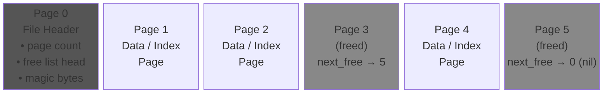

### Core Interface to Design

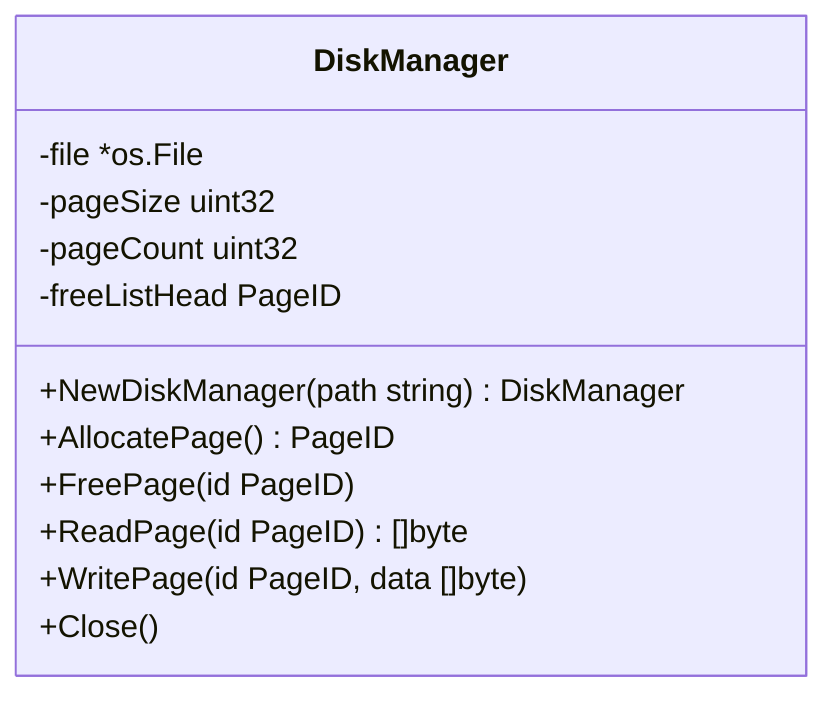

### Design Decisions to Make Early

1. **Single file vs multi-file?** Start with a single file. Simpler seeking logic.
2. **Page 0 header format** — define a struct for it: magic number, version, page size, page count, free list head. Serialize it with `encoding/binary`.
3. **Concurrency** — for now, a single `sync.Mutex` on the whole manager is fine. Real databases use more granular locking.
4. **`pread`/`pwrite` vs `Seek+Read`** — Go's `File.ReadAt` and `File.WriteAt` are offset-based and safe for concurrent use on the same `*os.File`, so prefer those.

---

## 2 — Buffer & Cache Manager

The database never reads from disk into the layer that needs it directly. Instead, every page lives in a **buffer pool** — a fixed-size array of in-memory page frames. This is *your* page cache (you don't rely on the OS page cache).

### Core Concepts

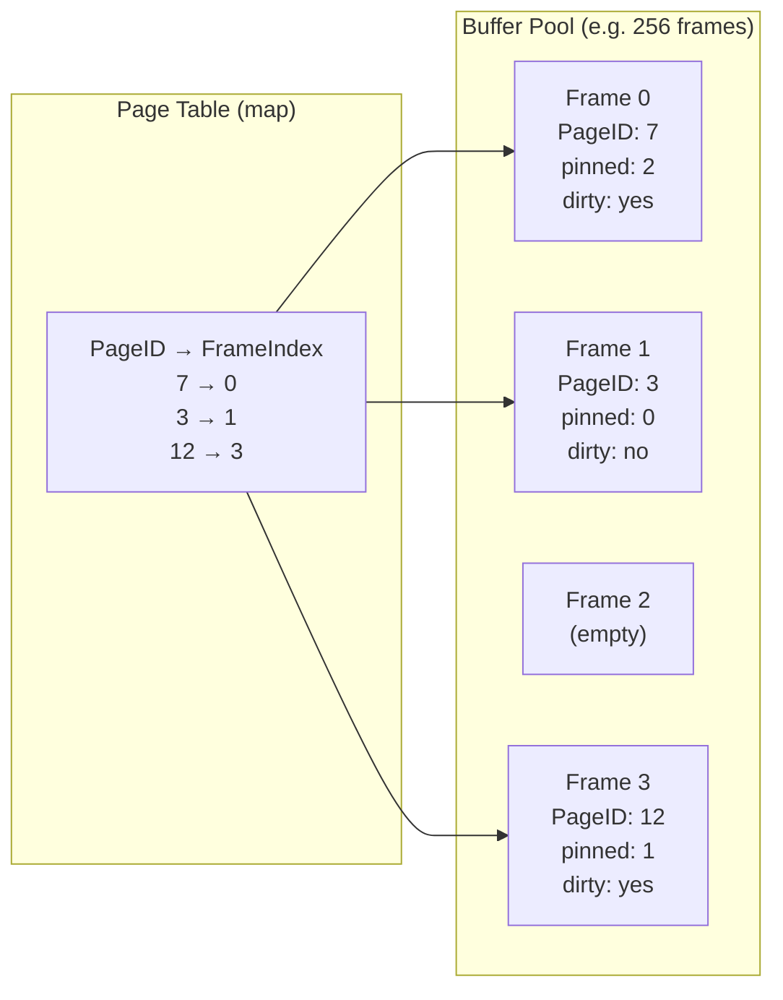

### Pin / Unpin Lifecycle

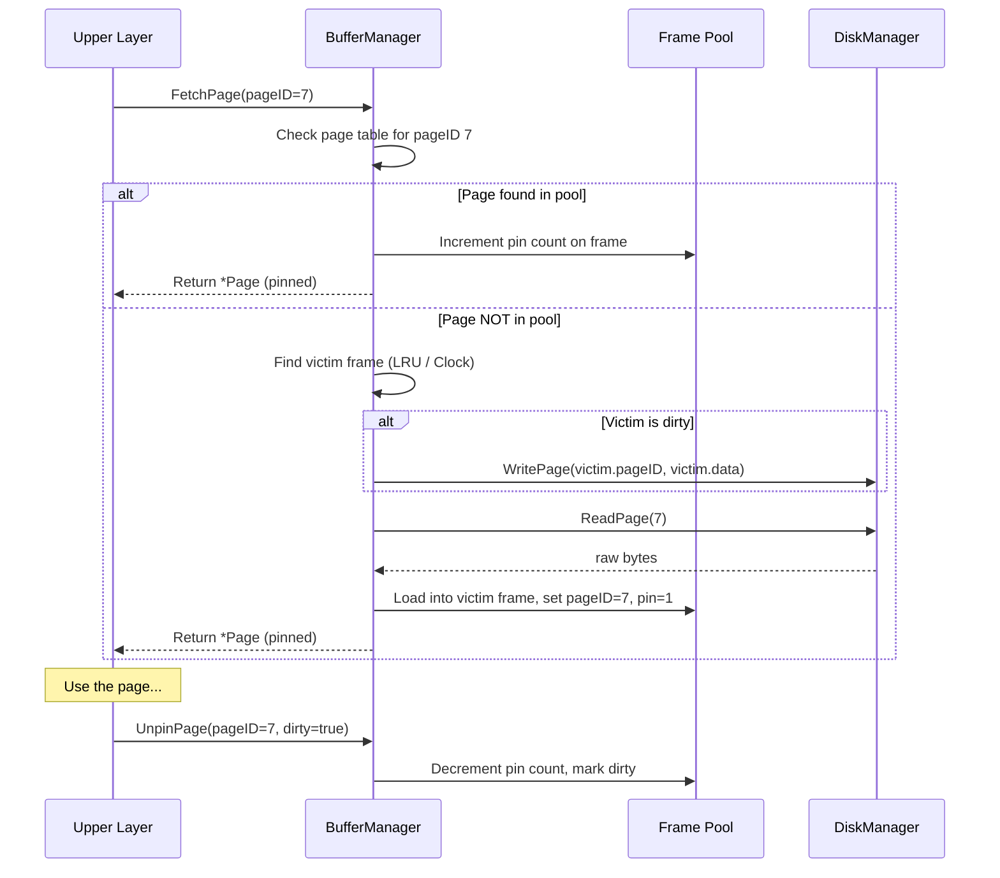

### Eviction — Clock Algorithm

The Clock algorithm is simpler than full LRU and works well. Think of frames arranged in a circle with a "clock hand":

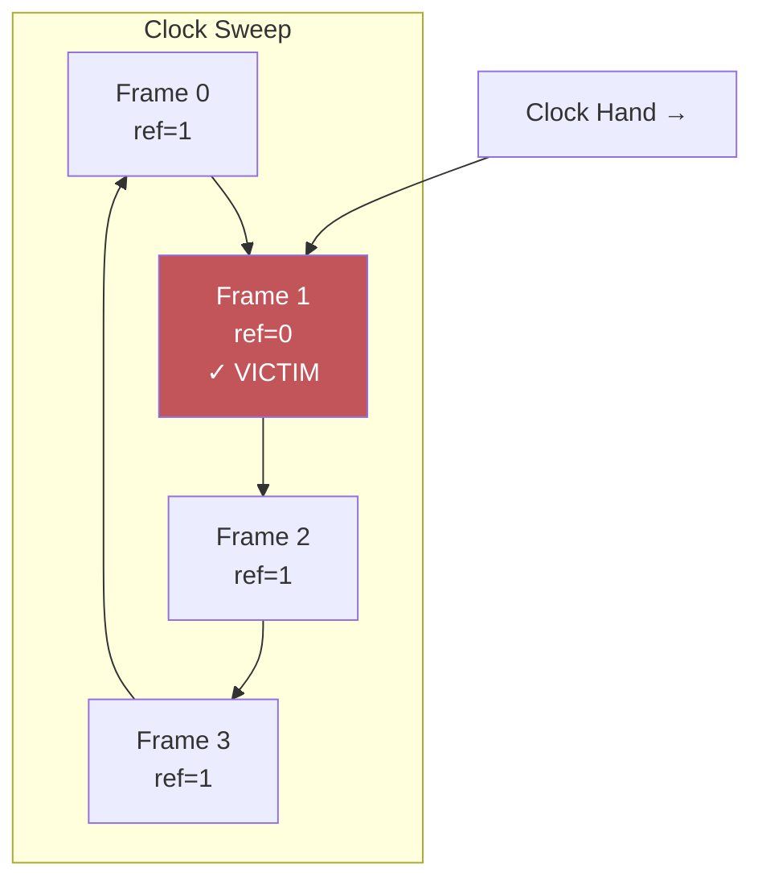

**Rules:** When you need a victim: advance the hand. If `ref bit == 1`, set it to `0` and move on. If `ref bit == 0` and `pin count == 0`, evict that frame. On every `FetchPage`, set the frame's ref bit to `1`.

### Core Interface

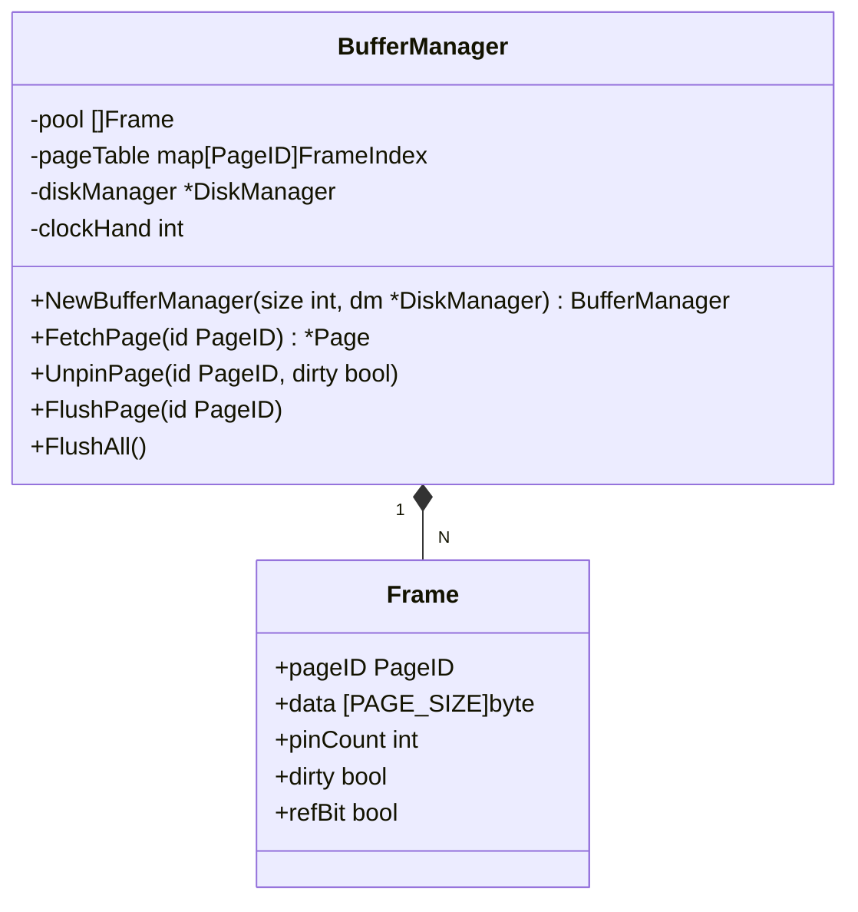

### Key Design Decisions

1. **Pool size** — make it configurable. 256 frames × 4 KB = 1 MB. Tiny but perfect for learning.
2. **`*Page` wrapper** — the pointer you return to callers should give access to the raw `[]byte` data *and* the `PageID`, but should not let callers mess with pin counts directly.
3. **When to flush** — only on eviction or explicit `FlushPage`/`FlushAll`. This gives you write batching for free.
4. **Thread safety** — one `sync.RWMutex` on the whole pool to start with.

---

## 3 — Slotted Page Layer

This layer gives **structure** to the raw 4 KB byte slabs. It implements a slotted page layout so you can store variable-length tuples (rows) and address them by `(PageID, SlotIndex)`.

### Page Internal Layout

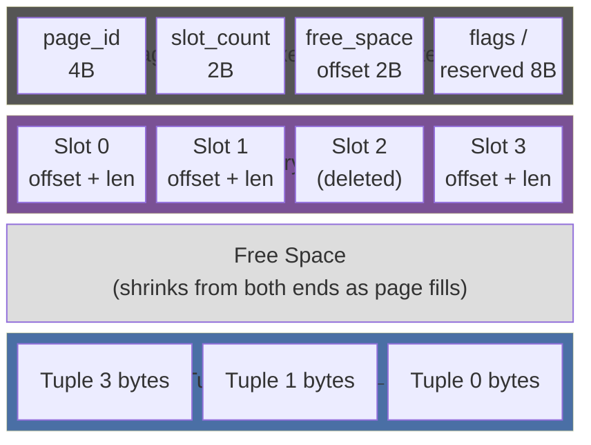

**The slot directory grows forward from the header. Tuple data grows backward from the end of the page. They meet in the middle when the page is full.**

### Tuple Addressing

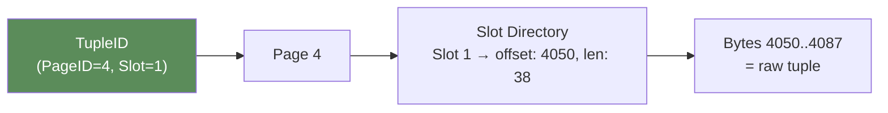

A **TupleID** (sometimes called RID — Record ID) is always `(PageID, SlotIndex)`. This is the physical address every upper layer uses to refer to a row.

### Insert / Delete / Update Flow

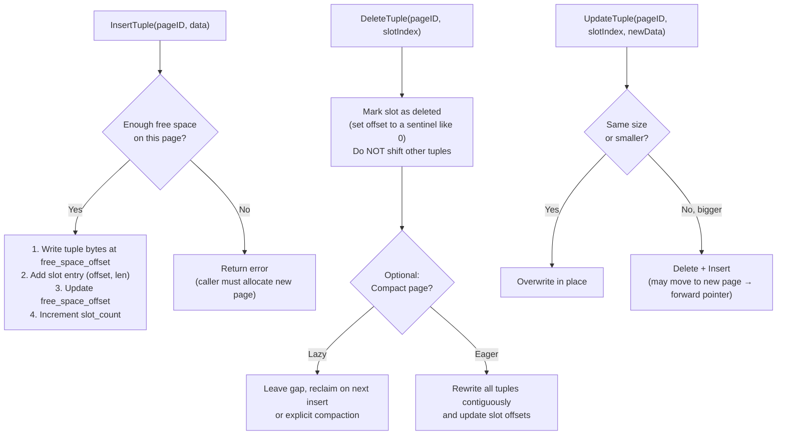

### Core Interface

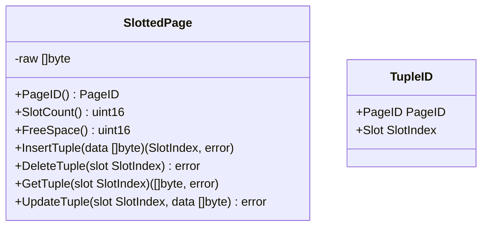

### Design Decisions

1. **Slot entry size** — 4 bytes is enough: 2 bytes for offset within the page (max 65535, more than your 4096 page), 2 bytes for length.
2. **Deletion strategy** — use a tombstone in the slot directory. Don't physically remove the tuple immediately. This keeps all existing `TupleID`s stable.
3. **Page compaction** — implement it, but call it lazily (only when an insert fails due to fragmentation but total free bytes are sufficient).
4. **This layer does NOT know about the buffer pool.** It receives a `[]byte` slice and operates purely on the bytes. The caller (Table layer) fetches/unpins pages via the Buffer Manager.

---

## 4 — B-Tree & LSM Layer

This is where you get fast lookups. A **B+Tree** is the standard choice for a disk-oriented database. An **LSM Tree** is optional but great for learning about write-optimised storage.

### B+Tree Structure

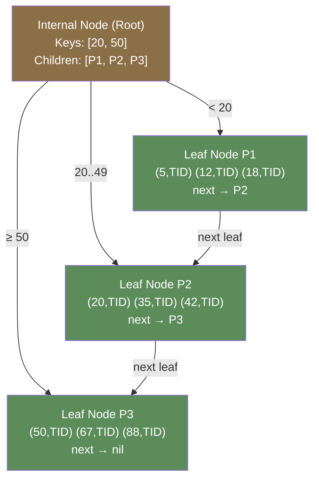

**Key properties of a B+Tree:**
- All actual data pointers (TupleIDs) live in **leaf nodes** only.
- Internal nodes store only keys + child page pointers (used for routing).
- Leaf nodes are linked together (next-leaf pointer) so range scans just follow the chain.
- Each node is exactly **one page** on disk.

### B+Tree Search

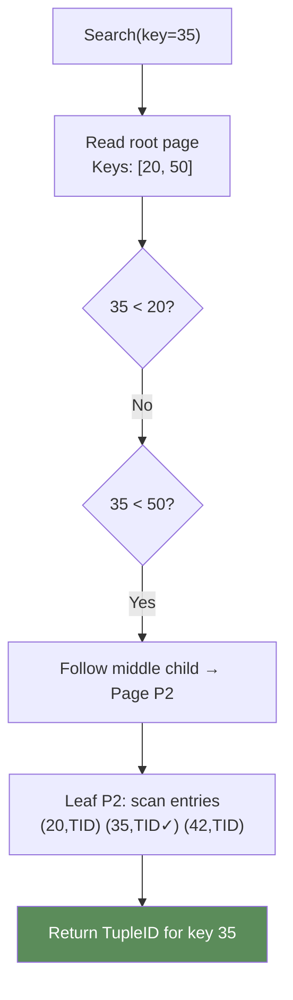

### B+Tree Insert & Split

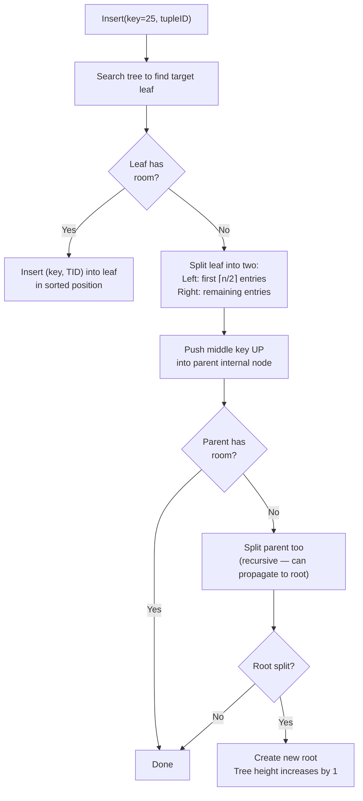

### Node Layout (reuse your Slotted Page!)

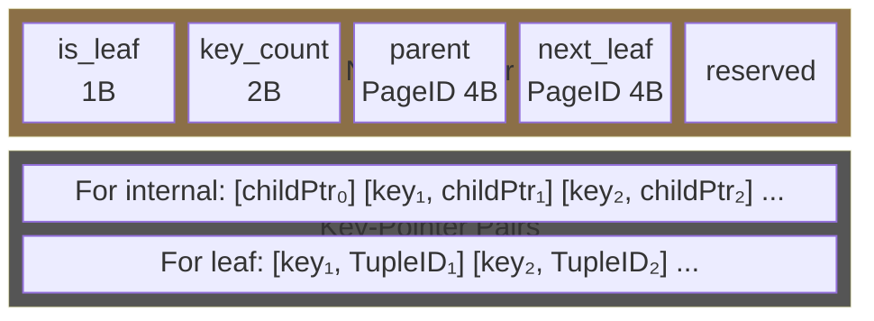

### Optional: LSM Tree

If you want to explore write-optimised storage after the B+Tree works:

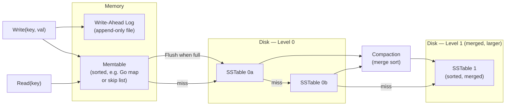

### Design Decisions

1. **Start with B+Tree.** It's the core of every traditional RDBMS and teaches you the most about page-oriented index structures.
2. **Order / fan-out** — calculate how many keys fit in one 4 KB page given your key size (e.g. 8-byte int keys + 4-byte child pointers → ~200 keys per node).
3. **B+Tree node = one page.** Use the Buffer Manager to fetch/unpin nodes. Each node's PageID *is* its address.
4. **Deletion** — start with lazy deletion (mark key as deleted). Full B+Tree merge/rebalance is complex and can be a later enhancement.
5. **LSM** — treat as a stretch goal. Implement B+Tree first.

---

## 5 — Table & Index Layer

This layer introduces the **logical** concepts of tables, rows, columns, schemas, and indexes. Below here everything was physical pages and bytes; from here up it's relational.

### Catalog / Schema Design

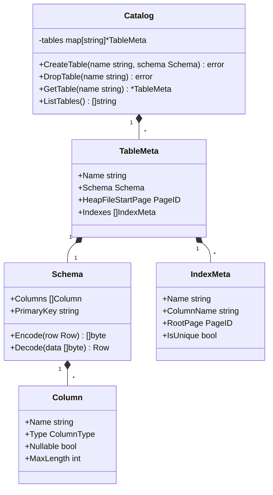

### Table Heap — Where Rows Live

A table's data is a linked list of slotted pages (a "heap file"):

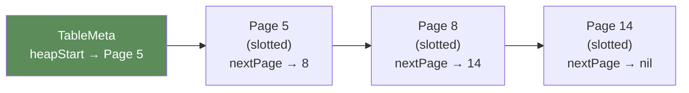

### Row Encoding

You need to serialize a `Row` (map of column name → value) into bytes for the slotted page, and deserialize back. A simple approach:

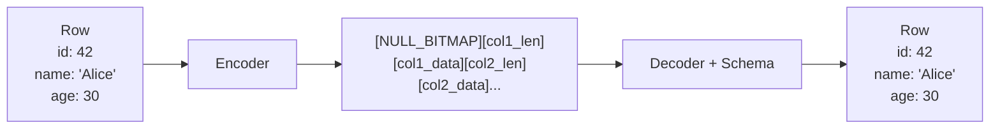

Use a **null bitmap** at the front (one bit per column), then serialize each non-null column value. For fixed-width types (int32, int64, bool) just write the bytes. For variable-width (string, blob) prefix with a 2-byte length.

### Query Execution Path (Full Lifecycle)

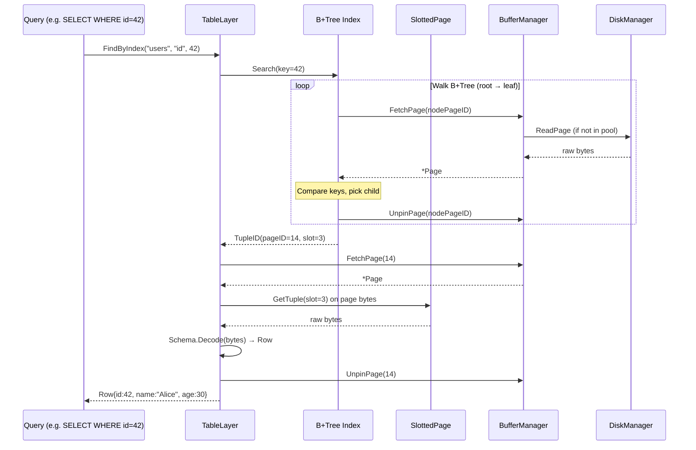

### Scan Types

```mermaid
flowchart TD
    QUERY["WHERE clause"] --> PLAN{"Index available\nfor this column?"}
    PLAN -->|Yes| IXSCAN["Index Scan\n1. Search B+Tree → TupleID\n2. Fetch that one page\nO(log n)"]
    PLAN -->|No| SEQSCAN["Sequential Scan\n1. Walk every page in heap\n2. Decode every tuple\n3. Apply filter\nO(n)"]
```

### Design Decisions

1. **Catalog storage** — the catalog itself should be stored in the database (a "system table" on page 1). For v1, you can keep it in memory and rebuild on startup by reading a reserved page.
2. **Row encoding** — keep it dead simple. Don't worry about compression or columnar storage.
3. **Heap organisation** — a simple linked list of pages per table. Track the "last page with free space" so inserts are fast.
4. **Type system** — start minimal: `Int32`, `Int64`, `Text`, `Bool`. That's enough to be useful.

---

## 6 — SQL Layer

The top of the stack. Transforms human-readable SQL text into calls against the Table & Index layer.

### Pipeline

```mermaid
flowchart LR
    SQL["SELECT name FROM users\nWHERE age > 25\nORDER BY name"]
    SQL --> LEX["Lexer\n(Tokenizer)"]
    LEX --> TOKENS["[SELECT] [name] [FROM]\n[users] [WHERE] [age]\n[>] [25] [ORDER] [BY] [name]"]
    TOKENS --> PARSE["Parser"]
    PARSE --> AST["Abstract Syntax Tree"]
    AST --> PLAN["Planner /\nOptimiser"]
    PLAN --> EXEC["Executor"]
    EXEC --> RESULT["Result Rows"]

    style SQL fill:#4a6fa5,color:#fff
    style RESULT fill:#5b8c5a,color:#fff
```

### AST Structure

```mermaid
classDiagram
    class Statement {
        <<interface>>
    }

    class SelectStmt {
        +Columns []string
        +Table string
        +Where *Expr
        +OrderBy []OrderClause
        +Limit *int
    }

    class InsertStmt {
        +Table string
        +Columns []string
        +Values [][]Expr
    }

    class CreateTableStmt {
        +Name string
        +Columns []ColumnDef
    }

    class Expr {
        <<interface>>
    }

    class BinaryExpr {
        +Left Expr
        +Op Token
        +Right Expr
    }

    class LiteralExpr {
        +Value interface{}
    }

    class ColumnRef {
        +Name string
    }

    Statement <|-- SelectStmt
    Statement <|-- InsertStmt
    Statement <|-- CreateTableStmt
    Expr <|-- BinaryExpr
    Expr <|-- LiteralExpr
    Expr <|-- ColumnRef
    SelectStmt *-- Expr : Where
```

### Planner — Logical to Physical

```mermaid
flowchart TD
    AST["SelectStmt\ntable: users\nwhere: age > 25\norderBy: name"]

    AST --> LP["Logical Plan"]

    subgraph LP["Logical Plan"]
        direction TB
        PROJ["Project\n(name)"]
        SORT["Sort\n(name ASC)"]
        FILT["Filter\n(age > 25)"]
        SCAN["Scan\n(users)"]
        PROJ --> SORT --> FILT --> SCAN
    end

    LP --> OPT["Optimiser\n• Push filters down\n• Choose index vs seq scan"]

    OPT --> PP["Physical Plan"]

    subgraph PP["Physical Plan"]
        direction TB
        PROJ2["Project (name)"]
        SORT2["Sort (name ASC)"]
        IXSCAN2["IndexScan\n(users.age_idx, > 25)"]
        PROJ2 --> SORT2 --> IXSCAN2
    end
```

### Volcano / Iterator Execution Model

Every node in the physical plan is an **iterator** with a `Next() → Row` interface. Rows flow upward one at a time:

```mermaid
sequenceDiagram
    participant Client
    participant Proj as Project
    participant Sort as Sort
    participant Scan as IndexScan

    Client->>Proj: Next()
    Proj->>Sort: Next()

    Note over Sort: First call → pull ALL rows to sort
    loop Pull all rows
        Sort->>Scan: Next()
        Scan-->>Sort: Row (or EOF)
    end
    Note over Sort: Sort in memory

    Sort-->>Proj: Row (first sorted)
    Proj-->>Client: Row (projected columns only)

    Client->>Proj: Next()
    Proj->>Sort: Next()
    Sort-->>Proj: Row (second sorted)
    Proj-->>Client: Row (projected columns only)

    Client->>Proj: Next()
    Proj->>Sort: Next()
    Sort-->>Proj: EOF
    Proj-->>Client: EOF
```

### Supported SQL (Recommended Starting Set)

```mermaid
mindmap
  root((SQL Subset))
    DDL
      CREATE TABLE
      DROP TABLE
    DML
      SELECT
        WHERE
        ORDER BY
        LIMIT
      INSERT
      UPDATE ... WHERE
      DELETE ... WHERE
    Expressions
      Comparisons: = != < > <= >=
      Logical: AND OR NOT
      Literals: int, string, bool
```

### Design Decisions

1. **Lexer** — hand-write it. SQL tokens are simple enough that you don't need a generator. A `switch` on the current character with a `readWhile` helper covers 90% of cases.
2. **Parser** — recursive descent (one function per grammar rule: `parseSelect()`, `parseExpr()`, etc.). This is the most educational approach.
3. **No JOINs in v1.** Single-table queries are plenty to get the full stack working end-to-end.
4. **Optimiser** — start with two rules only: (a) choose index scan if an index exists on the WHERE column, (b) otherwise sequential scan. That's it.
5. **Error handling** — return clear error messages with the position in the SQL string where parsing failed.

---

## Suggested Build Order

```mermaid
flowchart TD
    M1["Milestone 1\nDisk Manager\n• Read/Write pages\n• Free list\n• Unit tests: alloc, free, persist"]
    M2["Milestone 2\nBuffer Manager\n• Buffer pool + page table\n• Pin/Unpin/Flush\n• Clock eviction\n• Test: eviction under pressure"]
    M3["Milestone 3\nSlotted Page\n• Insert/Get/Delete tuples\n• Page compaction\n• Test: fill page, delete, re-insert"]
    M4["Milestone 4\nB+Tree\n• Search, Insert, Split\n• Range scan via leaf chain\n• Test: insert 10k keys, verify order"]
    M5["Milestone 5\nTable & Index Layer\n• Schema, Catalog\n• Heap scan, Index scan\n• Row encode/decode\n• Test: CRUD on a table"]
    M6["Milestone 6\nSQL Layer\n• Lexer → Parser → AST\n• Planner + Executor\n• Wire it all together\n• Test: run SQL against your engine"]

    M1 --> M2 --> M3 --> M4 --> M5 --> M6

    style M1 fill:#555,color:#fff
    style M2 fill:#c2555a,color:#fff
    style M3 fill:#7a5195,color:#fff
    style M4 fill:#8b6f47,color:#fff
    style M5 fill:#5b8c5a,color:#fff
    style M6 fill:#4a6fa5,color:#fff
```

### Testing Strategy Per Milestone

| Milestone | Key Tests |
|---|---|
| **Disk Manager** | Allocate N pages, write data, close file, reopen, read back, verify. Free pages and reallocate — confirm reuse. |
| **Buffer Manager** | Fetch more pages than pool size — confirm eviction works. Pin a page, confirm it's never evicted. Dirty pages flushed on eviction. |
| **Slotted Page** | Fill a page to capacity. Delete from the middle. Insert again (reclaim space). Verify tuple data integrity round-trip. |
| **B+Tree** | Insert 10,000 sequential keys, then 10,000 random keys. Point lookups on all of them. Range scan and verify sorted order. Delete keys and verify. |
| **Table & Index** | Create table with schema. Insert 1,000 rows. Sequential scan with filter. Index lookup. Update and delete rows. |
| **SQL** | Parse valid and invalid SQL. Execute `CREATE TABLE`, `INSERT`, `SELECT ... WHERE`, `DELETE`. End-to-end: SQL string in → result rows out. |

---

## Reference: Complete Data Flow for `SELECT name FROM users WHERE id = 42`

```mermaid
flowchart TD
    SQL["SQL: SELECT name FROM users WHERE id = 42"]
    SQL --> LEX["Lexer → tokens"]
    LEX --> PARSE["Parser → SelectStmt AST"]
    PARSE --> PLAN["Planner: id has index → IndexScan"]
    PLAN --> EXEC["Executor calls TableLayer.FindByIndex"]

    EXEC --> BT["B+Tree.Search(42)"]
    BT --> BUF1["BufferMgr.FetchPage(root node)"]
    BUF1 --> DISK1["DiskMgr.ReadPage (if cache miss)"]
    DISK1 --> BUF1
    BUF1 --> BT
    BT --> BUF2["BufferMgr.FetchPage(leaf node)"]
    BUF2 --> BT
    BT --> TID["Found: TupleID(page=14, slot=3)"]

    TID --> BUF3["BufferMgr.FetchPage(14)"]
    BUF3 --> SLOT["SlottedPage.GetTuple(slot=3)"]
    SLOT --> DECODE["Schema.Decode → Row{id:42, name:'Alice', age:30}"]
    DECODE --> PROJECT["Project: keep only 'name'"]
    PROJECT --> RESULT["Result: 'Alice'"]

    style SQL fill:#4a6fa5,color:#fff
    style RESULT fill:#5b8c5a,color:#fff
```
